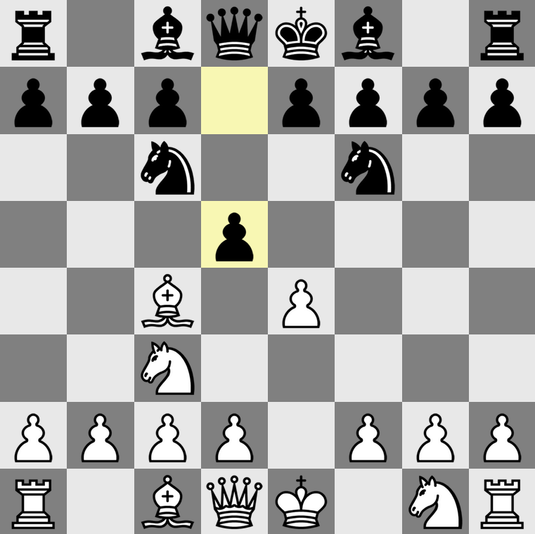
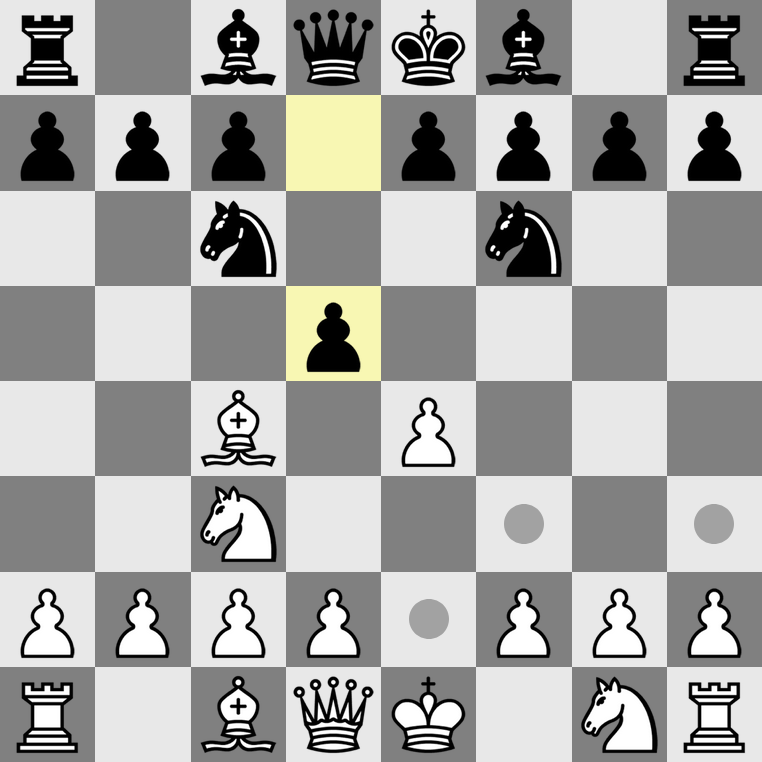

# hobby chess bot

just a simple chess engine that is written in typescript. made me realize how
insufferably slow javascript can get when anything you do is remotely comput-
ationally heavy.

---

## some images

---

## features

- game draws a board
- checkmate/draws
- FEN string parsing
- legality checking
- board flipping
- board resetting

---

## license

this generic chess bot is licensed under the gplv3. see [`LICENSE`](./LICENSE).

---

## show some love

if you like this project, toss it a star on [github](https://github.com/alperenozdnc/chess-bot).
